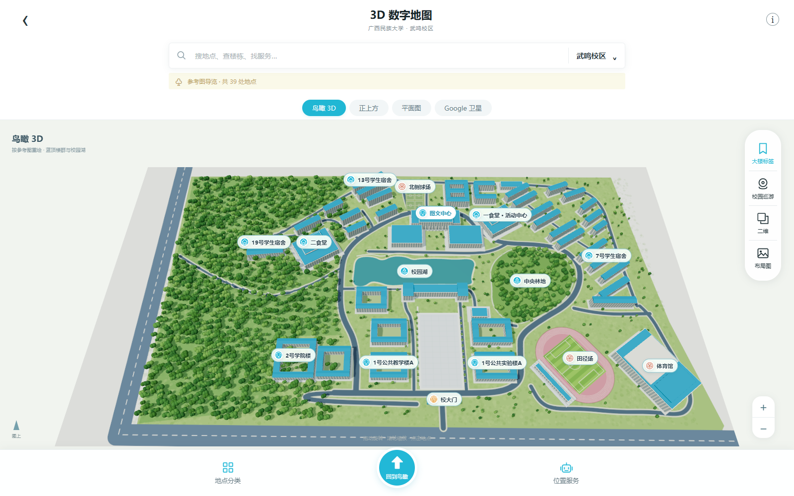

# 武鸣校区校园地图

一个可旋转、搜索和切换视角的校园地图示意项目，采用 Three.js、原生 HTML/CSS/JavaScript 和 Node.js。源码按 **MIT** 许可证开放，可修改和再分发。

**在线地图：[打开武鸣校区 3D 导览](https://hzc1045-web.github.io/wuming-campus-map/?v=reference-20260918)**。直接分享这个地址即可，访客无需安装，也不依赖你的电脑开机。



## 已有功能

- 鸟瞰 3D、正上方、二维平面图及 Google 在线卫星对照入口。
- 根据 2026-09-18 提供的校园导览图重绘，39 个地点、78 个建筑单体、2,300 株实例化林木。
- 补齐左上方宿舍区与二食堂，调整图文中心、校园湖、中轴广场、环路、田径场和体育馆。
- 蓝色屋顶、庭院楼群、自然湖岸与紧凑标签；点击或搜索地点后自动靠近查看。
- 地点搜索、分类筛选、位置服务列表、标签、巡游与缩放。
- 电脑和手机自适应，Three.js 随包提供。

## 快速运行

安装 [Node.js 20 或更新版本](https://nodejs.org/)，然后**完整解压**此文件夹。

Windows：双击根目录 **start.cmd**。它会打开地图；若默认端口被占用，会尝试后续端口。保持启动窗口开启，关闭窗口或按 Ctrl+C 停止服务。

其他系统，或使用命令行：

```sh
node server.cjs
```

浏览器打开终端显示的地址，默认是 http://127.0.0.1:8120/ 。也可使用 `npm start`；**不需要 npm install，不需要 API 密钥**。不要直接双击 public/index.html，浏览器模块需要本地 HTTP 服务。

需要换端口时，PowerShell 示例：

```powershell
$env:CAMPUS_PORT = '8121'
node server.cjs
```

macOS/Linux：

```sh
CAMPUS_PORT=8121 node server.cjs
```

## 项目结构

```text
wuming-campus-map/
  public/             网页、场景源码、布局示意及 Three.js
  scripts/start.cjs   打开浏览器的便携启动器
  test/               Node.js 内置测试
  docs/               预览、已知限制、验证说明
  server.cjs          本地服务器与 Google 连接检测
  start.cmd           Windows 双击入口
  LICENSE             项目 MIT 许可证
  THIRD_PARTY_NOTICES.md
```

## 检查与修改

```sh
npm run check
npm test
```

运行时仅使用 Node.js 内置模块，测试也不需要安装依赖。地点、道路和景观配置在 public/campus-layout.js；楼群和场景生成在 public/campus-scene.js；交互在 public/app.js。界面在 public/index.html 和 public/style.css。修改地点后执行 `npm run layout` 同步生成布局索引。贡献说明见 [CONTRIBUTING.md](CONTRIBUTING.md)。

公开网页由 GitHub Pages 托管，发布源为 gh-pages 分支根目录，内容对应 public/。所有地图资源使用相对路径，支持项目子目录部署。Google 在线影像通过外部入口查看，本地预览保留服务器连接检测。

## Google 地图与准确性

**本包不是卫星实景模型。** Google 对照入口已接入，但制作环境无法连接 Google，因此实际影像加载及模型与影像的配准尚未完成。学校布局、楼高及地形仍为示意，不用于精确导航。完整限制见 [docs/LIMITATIONS.md](docs/LIMITATIONS.md)。

原始参考照片和应用截图未纳入开源包，布局对照使用本项目程序绘制的 SVG。Three.js 的 MIT 许可证已保留；Google 在线内容不属于本项目许可证，详见 [第三方声明](THIRD_PARTY_NOTICES.md)。

## 分享源码

可以直接分享源码包，或访问 [GitHub 公共仓库](https://github.com/hzc1045-web/wuming-campus-map)。根目录包含 README、许可证和忽略规则。
